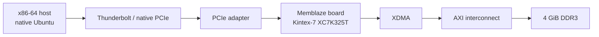

# Memblaze K7 XDMA Lab

Linux XDMA bring-up and DDR3 integrity tests for one reverse-engineered
Memblaze/PBlaze3 board built around the Kintex-7 XC7K325T. The exact supported
board marking and revision will be frozen with the final wiring/BOM record.

[简体中文](README.zh-CN.md) · [Docs map](docs/README.md) ·
[Validated results](docs/VALIDATED_RESULTS.zh-CN.md) ·
[Hardware setup](docs/HARDWARE_SETUP.zh-CN.md) ·
[Next experiments](docs/NEXT_EXPERIMENTS.zh-CN.md)

> **Project status:** pre-publication `v0.1.0-lab`. The complete FPGA build
> inputs live under `fpga/` and build directly from `fpga/build.tcl`.
> A clean Vivado 2026.1 build and the matching exact-bitstream physical
> RC4 regression passed natively with final return code 0. The final power/JTAG
> wiring figure is still pending.
> No public push should be made until every release blocker in
> `docs/OPEN_ITEMS.zh-CN.md` is closed.

## What this repository provides

- A source-controlled Vivado 2026.1 flow for `xc7k325tffg900-2`, including the
  XDMA/MIG block design generator, board constraints, DDR3 MIG configuration,
  routed timing checks, and optional bitstream generation.
- A pinned Xilinx XDMA Linux driver snapshot and a Linux 7.0 Kbuild patch.
- Guarded scripts for probe, build, Secure Boot inspection, module loading,
  DMA round trips, extended DDR tests, and cleanup.
- Sanitized evidence from one completed board and host campaign.
- Practical notes covering power, JTAG, MOK signing, Windows/WSL limits,
  PCIe link interpretation, and the failures encountered during bring-up.

Generated Vivado products and bitstreams are intentionally not committed.
Clone the repository, build the included FPGA source locally, review the
reports, and program the resulting image into volatile configuration SRAM.
The build does not consume another FPGA project, Git commit, DCP, or generated
checkpoint. Vivado 2026.1 and its installed AMD IP catalog remain required
toolchain prerequisites.

## Data path



The exact repository-built image enumerated as `10ee:7024` with subsystem
`10ee:0007`, built and loaded XDMA v2025.2.0 with Secure Boot kept enabled, and
completed basic, concurrent, and full-address-space DDR round trips. The tested
bitstream SHA-256 exactly matches the clean-build evidence.

## Results at a glance

| Gate | Current evidence |
|---|---|
| Repository FPGA source | Complete inputs are stored under `fpga/`; the entry point is `fpga/build.tcl` |
| Repository image | Clean Vivado 2026.1 build and matching RC4 exact-bitstream physical regression passed with final RC=0 |
| JTAG configuration | XC7K325T SRAM programming completed; no configuration-flash write |
| PCIe enumeration | Exactly one `10ee:7024`, subsystem `10ee:0007` endpoint |
| XDMA build | Driver v2025.2.0 built for `7.0.0-31-generic` |
| Secure Boot | Remained enabled; a locally signed module was accepted after MOK enrollment |
| Driver binding | Control, two H2C, and two C2H nodes appeared |
| Basic DMA | 4 KiB ch0, 1 MiB ch0, 1 MiB ch1, and an independent 64 MiB run matched byte for byte |
| 4 GiB addressing | Five distinct 1 MiB sentinels at 0, 1, 2, 3 GiB and `0xFFF00000` matched |
| First 1 GiB | 16 × 64 MiB written, read, and compared successfully |
| Concurrent DMA | Channels 0 and 1 simultaneously transferred and compared 64 MiB each |
| Full 4 GiB | 64 × 64 MiB written, read, and compared; 64/64 chunks matched |
| Cleanup | Module unloaded and `/dev/xdma*` nodes disappeared |

The clean build completed with DRC Error 0, setup WNS `+0.038 ns`, hold WHS
`+0.014 ns`, and 10/10 bus-skew constraints passing. Its bitstream SHA-256 is
`287f0ff1e9a0bef58842d1769e782fe06ed16cf3019d8e65477ca7a688f5b1c5`;
the bitstream remains outside Git, while the same hash links its clean build,
JTAG report, and physical run. See the [sanitized build evidence](evidence/validated_repository_clean_build_vivado_2026_1_sanitized.log)
and [physical evidence](evidence/validated_repository_exact_image_physical_regression_sanitized.log).

The five sentinels independently check selected high-address windows. The final
run also covered all 4 GiB with 64 requests of 64 MiB each. A single monolithic
1 GiB request was not validated and remains intentionally excluded.

## Quick start

Read [the hardware setup](docs/HARDWARE_SETUP.zh-CN.md) before applying power.
Do not infer the external 12 V polarity, power-source isolation, or JTAG cable
direction from connector shape. The final wiring figure must settle those
details before publication.

### 1. Build and program the FPGA

Install Vivado 2026.1 with support and a valid license for the Kintex-7 device
and the IP used by this design. AMD lists the annual
[Vivado BASIC tier](https://www.amd.com/en/products/software/adaptive-socs-and-fpgas/vivado/vivado-licensing-options.html)
at $0 with all 7 Series devices, and
[PG195](https://docs.amd.com/r/en-US/pg195-pcie-dma/Licensing-and-Ordering)
states that XDMA is provided at no additional cost under the Vivado EULA. The
exact clean build recorded by this repository was exercised with a 60-day
Enterprise evaluation license; BASIC is expected to cover this target from the
official tables, but has not been rerun locally. That extra license-tier retest
is environment coverage rather than a release blocker. The repository-local
flow consists of:

- `fpga/build.tcl` — project creation, implementation checks, reports, and
  optional bitstream generation;
- `fpga/create_project.tcl` — project and source-set creation;
- `fpga/bd/create_design.tcl` — XDMA-to-DDR block design;
- `fpga/constraints/board.xdc` — board and timing constraints;
- `fpga/mig/memblaze_ddr3.prj` — DDR3 MIG configuration;
- `fpga/program_sram.tcl` — volatile JTAG programming only.

Follow [`fpga/README.md`](fpga/README.md) for the exact command line. Review
DRC, setup, hold, and bus-skew reports before programming. The SRAM image is
lost after full power removal, so configure it before host PCIe enumeration.

```powershell
& 'C:\AMD\Vivado\2026.1\bin\vivado.bat' -mode batch `
  -source C:/work/memblaze-k7-xdma-lab/fpga/build.tcl `
  -tclargs C:/work/memblaze-build --write-bitstream
```

`C:/work/memblaze-build` must be an absolute path that does not yet exist.
The flow creates the project under `p/`, reports under `reports/`, and
`memblaze_k7_xdma_wrapper.bit` at the build root.

### 2. Run the native-Linux gates

Use native x86-64 Ubuntu or a verified persistent Live system. On Ubuntu 24.04,
install every command used by the public scripts with:

```bash
sudo apt update
sudo apt install --yes \
  bash coreutils diffutils gawk grep sed tar git build-essential patch kmod \
  pciutils mokutil openssl sudo udev util-linux psmisc \
  "linux-headers-$(uname -r)"

# Optional: only needed when boltctl is used to inspect Thunderbolt authorization.
sudo apt install --yes bolt
```

Before building on a persistent Live system, run `df -h / "$HOME" /dev/shm`.
Allow at least 2 GiB free in the persistent/root filesystem for packages,
driver objects, logs, and optional smoke payloads. `chunked-1g` keeps payloads
in RAM and checks for at least 218,103,808 free bytes in `/dev/shm`; 256 MiB or
more is a practical minimum. A custom 64 MiB smoke test stores about 128 MiB of
transmit and receive data below `$HOME`.

The write tests assume the active image was built from this repository and maps
the tested AXI range to external DDR. PCI ID `10ee:7024` alone does not prove
that mapping.

```bash
git clone https://github.com/HwzLoveDz/memblaze-k7-xdma-lab.git
cd memblaze-k7-xdma-lab

# Gate 1: read-only PCIe evidence
./linux/01_probe.sh

# Build only; nothing is installed or loaded
./linux/02_build_driver.sh

# Read-only Secure Boot/module-signature inspection
./linux/03_secure_boot_status.sh /path/to/your-public-mok.der

# Load only after signing/enrollment is ready
./linux/04_load_verify.sh

# These commands overwrite selected ranges of volatile FPGA DDR
./linux/05_dma_smoke.sh --confirm-ddr-write
./linux/06_extended_validation.sh --confirm-ddr-write alias-4g
./linux/06_extended_validation.sh --confirm-ddr-write chunked-1g
./linux/07_release_advanced.sh --confirm-ddr-write

# Separate cleanup gate
./linux/99_cleanup.sh
```

For release regression of an exact repository-built bitstream, use the
[one-session exact-image runbook](docs/EXACT_IMAGE_REGRESSION.zh-CN.md). Its
wrapper authenticates the bitstream and Windows JTAG report with separate
SHA-256 sidecars, then records BARs, a fresh driver build, existing-MOK signing,
both-channel DMA, full 4 GiB chunked comparison, kernel evidence, and cleanup
under one run ID. Once the protected write boundary is established, failures
also produce an evidence archive.

The scripts stop unless they find exactly one expected endpoint and, after
loading, verify that the required control, H2C0/H2C1, and C2H0/C2H1 nodes
belong to that endpoint. Logs and basic-test payload files are written under
`$HOME/memblaze-xdma-results/`.

For MOK key creation and signing, follow
[the Secure Boot guide](docs/SECURE_BOOT.zh-CN.md). The scripts never disable
Secure Boot or modify firmware settings.

## Platform notes

The data path uses native Linux because the public XDMA driver can be rebuilt,
inspected, signed, and bound directly to the endpoint. Windows can build and
program the FPGA and can enumerate the endpoint, but Windows DMA requires a
compatible signed Windows driver. Ordinary WSL2 cannot directly bind the
Thunderbolt PCIe endpoint owned by Windows. See
[Windows and WSL](docs/WINDOWS_WSL.zh-CN.md).

## License and provenance

Project-authored files are MIT-licensed unless a file says otherwise. The
bundled XDMA snapshot and the BSD-licensed Kbuild patch retain their own terms.
Vivado and AMD/Xilinx IP remain external tool dependencies and are not bundled.
See [`THIRD_PARTY_NOTICES.md`](THIRD_PARTY_NOTICES.md) and
[`NOTICE.md`](NOTICE.md).

This is an independent community project. It is not affiliated with or
endorsed by AMD, Xilinx, Memblaze, or their affiliates.
