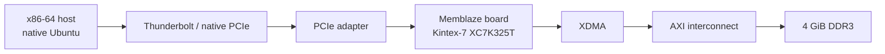

# Memblaze K7 XDMA Lab

I have a Memblaze/PBlaze3 controller board whose storage daughterboard was
already gone.
It is built around a Kintex-7 `XC7K325T` and still has 4 GiB of DDR3, so I wanted
to turn it back into a useful PCIe FPGA card. I traced the hardware, rebuilt the
Vivado design, and got XDMA running through a Thunderbolt 4 link on an ordinary
x86 host.

The project now builds a bitstream directly from source with Vivado 2026.1,
loads it into volatile SRAM over JTAG, enumerates as `10ee:7024` in Ubuntu, and
moves data between the host and the board's DDR3. I have tested both DMA
channels concurrently and compared all 4 GiB in 64 MiB chunks; all 64 chunks
matched.

[简体中文](README.zh-CN.md) · [Docs map](docs/README.md) ·
[Validated results](docs/VALIDATED_RESULTS.zh-CN.md) ·
[Hardware setup](docs/HARDWARE_SETUP.zh-CN.md) ·
[Status and next steps](docs/OPEN_ITEMS.zh-CN.md)

`v0.1.0-lab` is the first release I assembled from the completed hardware run.
The clean Vivado build, JTAG configuration, and Ubuntu tests all used the same
bitstream, and the complete flow finished successfully on the board. The FPGA
build starts at `fpga/build.tcl`.


For this setup I used a Flow Z13, a Thunderbolt/USB4 M.2 enclosure, and an M.2
to PCIe x4 adapter. A separate USB-C PD source and trigger module provide 12 V;
the M.2 slot provides 3.3 V. The two board power rails are fully isolated with
no backfeed, and the high-speed FPGA bank voltage comes from the PCIe input
side.

## Hardware I used


The complete connection is in the [hardware guide](docs/HARDWARE_SETUP.zh-CN.md).

## What you can do with it

I collected the FPGA design, Linux driver, test scripts, and the logs from this
hardware run in one place:

- Build XDMA, MIG, and the complete bitstream from source with Vivado 2026.1.
- Build and load XDMA v2025.2.0 on Linux 7.0.
- Inspect PCIe, BARs, Secure Boot signatures, and XDMA device nodes.
- Run basic DMA, concurrent dual-channel transfers, and a full 4 GiB DDR test.
- Save logs for each run, then unload the driver and clean up the device nodes.
- Follow the notes on power, JTAG, MOK, Windows/WSL, and the problems I hit.

I did not commit generated Vivado products or a bitstream. Clone the repository
and build directly from the included source; the flow does not depend on a
second FPGA project, DCP, or generated checkpoint. You need Vivado 2026.1 and
its AMD IP catalog.

## How the data path works

The host reaches the FPGA through Thunderbolt 4 and the M.2 adapter. Inside the
FPGA, XDMA converts PCIe requests to AXI and MIG connects AXI to the 4 GiB DDR3.



The board enumerated as `10ee:7024` with subsystem `10ee:0007`. Secure Boot
stayed enabled while XDMA v2025.2.0 was built, signed, loaded, and used for the
complete data test.

## What I tested

I took this from a clean FPGA build through a complete 4 GiB DDR3 data loop.

| Test | Result |
|---|---|
| Repository FPGA source | Complete inputs are stored under `fpga/`; the entry point is `fpga/build.tcl` |
| Repository image | Clean Vivado 2026.1 build and the matching-bitstream hardware test both passed |
| JTAG configuration | XC7K325T SRAM programming completed; no configuration-flash write |
| PCIe enumeration | Exactly one `10ee:7024`, subsystem `10ee:0007` endpoint |
| XDMA build | Driver v2025.2.0 built for `7.0.0-31-generic` |
| Secure Boot | Remained enabled; a locally signed module was accepted after MOK enrollment |
| Driver binding | Control, two H2C, and two C2H nodes appeared |
| Basic DMA | 4 KiB ch0, 1 MiB ch0, 1 MiB ch1, and an independent 64 MiB run matched byte for byte |
| 4 GiB addressing | Five distinct 1 MiB sentinels at 0, 1, 2, 3 GiB and `0xFFF00000` matched |
| First 1 GiB | 16 × 64 MiB written, read, and compared successfully |
| Concurrent DMA | Channels 0 and 1 simultaneously transferred and compared 64 MiB each |
| Full 4 GiB | 64 × 64 MiB written, read, and compared; 64/64 chunks matched |
| Cleanup | Module unloaded and `/dev/xdma*` nodes disappeared |

I also kept the implementation results from the clean build: DRC Error 0,
setup WNS `+0.038 ns`, hold WHS `+0.014 ns`, and 10/10 bus-skew constraints
passing. Its bitstream SHA-256 is
`287f0ff1e9a0bef58842d1769e782fe06ed16cf3019d8e65477ca7a688f5b1c5`;
the bitstream remains outside Git, while the same hash links its clean build,
JTAG report, and physical run. See the [sanitized build evidence](evidence/validated_repository_clean_build_vivado_2026_1_sanitized.log)
and [physical evidence](evidence/validated_repository_exact_image_physical_regression_sanitized.log).

Five independent sentinels check the high address windows, and the full test
covers all 4 GiB with 64 requests of 64 MiB each. A monolithic 1 GiB request
puts too much pressure on host-side allocation, so the scripts use 64 MiB chunks.

## How to reproduce it

Connect PCIe, both power rails, JTAG, and cooling; build and configure the FPGA
with Vivado; then keep the board powered while rebooting into native Ubuntu for
enumeration, driver loading, and DMA. See the
[hardware guide](docs/HARDWARE_SETUP.zh-CN.md) for the connection I used.

### 1. Build and program the FPGA

Install Vivado 2026.1 with support and a valid license for the Kintex-7 device
and the IP used by this design. AMD lists the annual
[Vivado BASIC tier](https://www.amd.com/en/products/software/adaptive-socs-and-fpgas/vivado/vivado-licensing-options.html)
at $0 with all 7 Series devices, and
[PG195](https://docs.amd.com/r/en-US/pg195-pcie-dma/Licensing-and-Ordering)
states that XDMA is provided at no additional cost under the Vivado EULA. I used
a 60-day Enterprise evaluation license for this clean build. I have not rebuilt
it under BASIC yet. The repository-local flow consists of:

- `fpga/build.tcl` — project creation, implementation checks, reports, and
  optional bitstream generation;
- `fpga/create_project.tcl` — project and source-set creation;
- `fpga/bd/create_design.tcl` — XDMA-to-DDR block design;
- `fpga/constraints/board.xdc` — board and timing constraints;
- `fpga/mig/memblaze_ddr3.prj` — DDR3 MIG configuration;
- `fpga/program_sram.tcl` — volatile JTAG programming only.

Follow [`fpga/README.md`](fpga/README.md) for the exact command line. Review
DRC, setup, hold, and bus-skew reports before programming. The SRAM image is
lost after full power removal, so configure it before host PCIe enumeration.

```powershell
& 'C:\AMD\Vivado\2026.1\bin\vivado.bat' -mode batch `
  -source C:/work/memblaze-k7-xdma-lab/fpga/build.tcl `
  -tclargs C:/work/memblaze-build --write-bitstream
```

`C:/work/memblaze-build` must be an absolute path that does not yet exist.
The flow creates the project under `p/`, reports under `reports/`, and
`memblaze_k7_xdma_wrapper.bit` at the build root.

### 2. Run the tests in native Ubuntu

Use native x86-64 Ubuntu or a verified persistent Live system. On Ubuntu 24.04,
install every command used by the public scripts with:

```bash
sudo apt update
sudo apt install --yes \
  bash coreutils diffutils gawk grep sed tar git build-essential patch kmod \
  pciutils mokutil openssl sudo udev util-linux psmisc \
  "linux-headers-$(uname -r)"

# Optional: only needed when boltctl is used to inspect Thunderbolt authorization.
sudo apt install --yes bolt
```

For a persistent Live system, keep at least 2 GiB free in the root persistence
layer and 256 MiB available in `/dev/shm`.

Before running the DDR write tests, load the bitstream built by this repository.
`10ee:7024` only tells you that the PCIe endpoint is present.

```bash
git clone https://github.com/HwzLoveDz/memblaze-k7-xdma-lab.git
cd memblaze-k7-xdma-lab

# Find the PCIe endpoint
./linux/01_probe.sh

# Build the driver
./linux/02_build_driver.sh

# Inspect Secure Boot, the module signature, and MOK
./linux/03_secure_boot_status.sh /path/to/your-public-mok.der

# Load and verify XDMA
./linux/04_load_verify.sh

# Run the DDR data tests
./linux/05_dma_smoke.sh --confirm-ddr-write
./linux/06_extended_validation.sh --confirm-ddr-write alias-4g
./linux/06_extended_validation.sh --confirm-ddr-write chunked-1g
./linux/07_release_advanced.sh --confirm-ddr-write

# Clean up
./linux/99_cleanup.sh
```

To replay the complete release test, use the
[one-session exact-image runbook](docs/EXACT_IMAGE_REGRESSION.zh-CN.md). It
checks the bitstream and JTAG record, then collects the driver build, DMA tests,
kernel log, and cleanup under one run ID.

The run first finds the single target endpoint, then checks its control,
H2C0/H2C1, and C2H0/C2H1 nodes. Logs and basic-test payloads are written under
`$HOME/memblaze-xdma-results/`.

For MOK key creation and signing, follow the
[Secure Boot guide](docs/SECURE_BOOT.zh-CN.md); the whole flow keeps Secure Boot
enabled.

## Why I used Ubuntu for the data path

I used Windows for the Vivado build, JTAG configuration, and PCIe enumeration.
The DMA tests run in native Ubuntu because the XDMA driver can be built directly
from this repository and the device state is visible through sysfs, `dmesg`,
and `/dev/xdma*`. Ordinary WSL2 cannot take over this Thunderbolt PCIe endpoint
from Windows. See
[Windows and WSL](docs/WINDOWS_WSL.zh-CN.md).

## License and provenance

Project-authored files are MIT-licensed unless a file says otherwise. The
bundled XDMA snapshot and the BSD-licensed Kbuild patch retain their own terms.
Vivado and AMD/Xilinx IP remain external tool dependencies and are not bundled.
See [`THIRD_PARTY_NOTICES.md`](THIRD_PARTY_NOTICES.md) and
[`NOTICE.md`](NOTICE.md).
