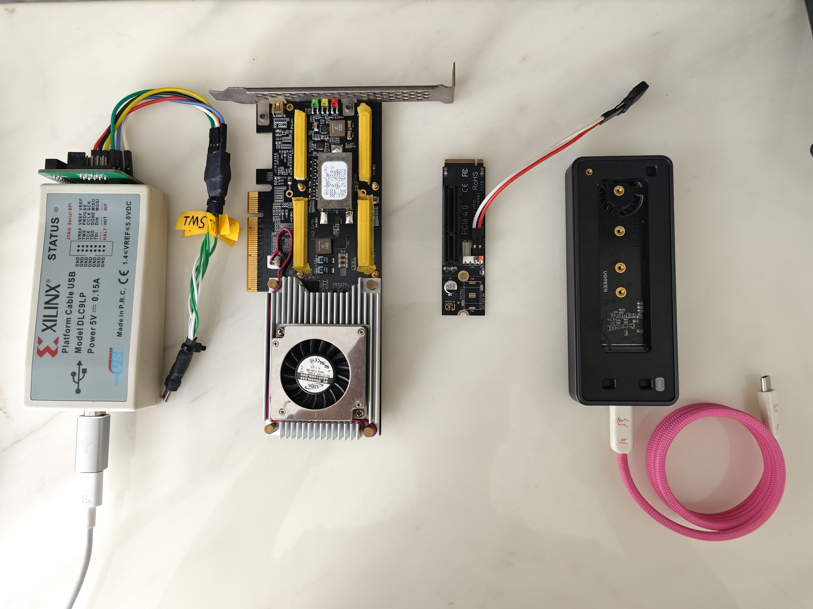
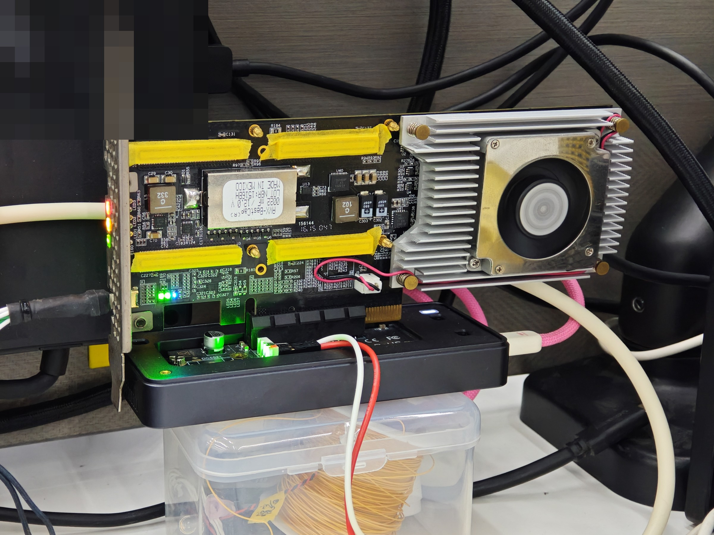

# Memblaze K7 XDMA Lab

这是一个面向照片所示 Memblaze/PBlaze3 XC7K325T 主板的 Linux XDMA 上手与
DDR3 数据一致性测试项目。仓库记录了本次实测组合、连接拓扑、FPGA 构建流、
Linux 驱动和 DMA 测试。

[English](README.md) · [文档地图](docs/README.md) ·
[实测结果](docs/VALIDATED_RESULTS.zh-CN.md) ·
[硬件连接](docs/HARDWARE_SETUP.zh-CN.md) ·
[待办与边界](docs/OPEN_ITEMS.zh-CN.md)

> **当前版本：** `v0.1.0-lab`。完整 FPGA 构建输入位于 `fpga/`，
> 入口为 `fpga/build.tcl`。Vivado 2026.1 干净构建和同一 bitstream 的
> RC4 精确映像实机回归均已通过，最终原生返回码为 0。供电拓扑和实物照片
> 已写入[硬件连接](docs/HARDWARE_SETUP.zh-CN.md)。


12 V 由独立 USB-C PD 电源经本次设定为 12 V 的诱骗模块送入 M.2↔PCIe
转接板辅助输入；3.3 V 由雷电/USB4 M.2 盒经 M.2 插槽提供。两路在 JTAG
配置前均已稳定，并从 Windows、主机重启到 Ubuntu 测试全程保持供电。12 V
与 3.3 V 两条供电轨在板上供电分配中完全隔离且不会回灌；板上高速 Bank 的
电压由 PCIe 输入侧决定。

## 实物与运行状态





[原生 Ubuntu 调试照片](docs/images/xdma-debug-session.jpg)记录了 64 MiB 分块
C2H 回读和比较过程。

## 仓库包含什么

- 面向 `xc7k325tffg900-2` 的 Vivado 2026.1 源码化构建流，包括 XDMA/MIG
  block design 生成、板级约束、DDR3 MIG 配置、实现检查和可选 bitstream；
- 固定版本的 Xilinx XDMA Linux 驱动源码快照和 Linux 7.0 Kbuild 补丁；
- 从只读探测、驱动构建、Secure Boot 检查、驱动加载、DMA 往返测试到
  清理的分步脚本；
- 一套已完成实机实验的脱敏证据；
- 供电、JTAG、MOK、Windows/WSL、PCIe 链路和实际踩坑说明。

Vivado 生成目录和 bitstream 不提交到 Git。使用者 clone 本仓库后，直接用
仓库内 FPGA 源构建，查看报告，再将生成的映像写入易失配置 SRAM。
构建过程不读取其他 FPGA 工程、外部 Git 提交、DCP 或生成检查点；仍需安装
Vivado 2026.1 及其 AMD IP catalog，这是工具链前置条件。

## 数据路径

```text
x86-64 主机 / 原生 Ubuntu
  └─ Thunderbolt 或原生 PCIe
      └─ PCIe 转接链路
          └─ Memblaze 主板 / XC7K325T
              └─ XDMA → AXI Interconnect → 4 GiB DDR3
```

仓库构建的确切映像枚举为 `10ee:7024`，Subsystem 为 `10ee:0007`；
Secure Boot 保持开启，XDMA v2025.2.0 完成构建、签名、加载、基础与并发 DMA，
并对完整 4 GiB DDR 做了分块数据闭环。实机使用的 bitstream SHA-256 与干净
构建证据完全一致。

## 当前证据

| 层级 | 当前结论 |
|---|---|
| 仓库 FPGA 源 | 完整构建输入位于 `fpga/`，入口为 `fpga/build.tcl` |
| 仓库映像 | Vivado 2026.1 干净构建和同一 bitstream 的 RC4 实机回归均通过，最终 RC=0 |
| JTAG | XC7K325T 易失 SRAM 配置成功；没有写 configuration flash |
| PCIe | 唯一 `10ee:7024`、Subsystem `10ee:0007` 端点被枚举 |
| 驱动构建 | XDMA v2025.2.0 在 `7.0.0-31-generic` 上构建成功 |
| Secure Boot | 保持开启；MOK 注册后的本地签名模块被内核接受 |
| 驱动绑定 | control、两组 H2C 和两组 C2H 节点出现 |
| 基础 DMA | 4 KiB ch0、1 MiB ch0、1 MiB ch1 和独立 64 MiB 均逐字节一致 |
| 4 GiB 寻址 | 0、1、2、3 GiB 和 `0xFFF00000` 的五个不同哨兵均一致 |
| 前 1 GiB | 16 × 64 MiB 分块写入、回读和比较全部通过 |
| 双通道并发 | channel 0/1 各 64 MiB 同时传输并分别比较通过 |
| 完整 4 GiB | 64 × 64 MiB 分块写入、回读和比较，64/64 块一致 |
| 清理 | 模块卸载，`/dev/xdma*` 节点消失 |

干净构建结果为 DRC Error 0、setup WNS `+0.038 ns`、hold WHS
`+0.014 ns`，10 条 bus-skew 约束全部通过。bitstream SHA-256 为
`287f0ff1e9a0bef58842d1769e782fe06ed16cf3019d8e65477ca7a688f5b1c5`；
bitstream 本体继续保留在 Git 之外，相同哈希已贯穿干净构建、JTAG 报告和实机
回归。详细记录见[脱敏构建证据](evidence/validated_repository_clean_build_vivado_2026_1_sanitized.log)
和[实机证据](evidence/validated_repository_exact_image_physical_regression_sanitized.log)。

五个哨兵独立检查高地址窗口；最终实验又用 64 个 64 MiB 请求覆盖完整 4 GiB。
单次 1 GiB 请求仍未验证通过，因此公开流程继续限制单请求不超过 64 MiB。

## 上手顺序

先阅读[硬件连接与上电边界](docs/HARDWARE_SETUP.zh-CN.md)并核对
[连接拓扑](docs/images/wiring-overview.svg)。

### 1. 构建并配置 FPGA

安装 Vivado 2026.1，并确保许可证覆盖 Kintex-7 器件和本设计使用的 IP。
AMD 官方把年度
[Vivado BASIC](https://www.amd.com/en/products/software/adaptive-socs-and-fpgas/vivado/vivado-licensing-options.html)
列为 0 美元且覆盖全部 7 Series；
[PG195](https://docs.amd.com/r/en-US/pg195-pcie-dma/Licensing-and-Ordering)
说明 XDMA 在 Vivado EULA 下不另收费。本仓库记录的精确干净构建使用了
60 天 Enterprise 评估许可；按官方表格 BASIC 应覆盖该器件和 IP，但本机
尚未用 BASIC 重跑。这个许可证档位复测属于环境覆盖，不阻塞发布。
仓库内 FPGA 构建输入为：

- `fpga/build.tcl`：创建工程、综合实现、检查报告和可选 bitstream；
- `fpga/create_project.tcl`：创建工程和源码集合；
- `fpga/bd/create_design.tcl`：XDMA 到 DDR 的 block design；
- `fpga/constraints/board.xdc`：板级与时序约束；
- `fpga/mig/memblaze_ddr3.prj`：DDR3 MIG 配置；
- `fpga/program_sram.tcl`：只写易失配置 SRAM。

具体命令见 [`fpga/README.md`](fpga/README.md)。写入前检查 DRC、setup、
hold 和 bus-skew 报告。完全断电后 SRAM 映像会消失，必须在主机 PCIe 枚举
前重新配置。

```powershell
& 'C:\AMD\Vivado\2026.1\bin\vivado.bat' -mode batch `
  -source C:/work/memblaze-k7-xdma-lab/fpga/build.tcl `
  -tclargs C:/work/memblaze-build --write-bitstream
```

`C:/work/memblaze-build` 必须是绝对路径且事先不存在。工程生成在
`p/`，报告位于 `reports/`，bitstream 为构建根目录下的
`memblaze_k7_xdma_wrapper.bit`。Windows 建议使用短路径。

### 2. 依次运行原生 Linux 门

建议使用原生 x86-64 Ubuntu，或完成重启持久化验证的 Live 系统。Ubuntu
24.04 可用下面的命令一次装齐公开脚本实际调用的依赖：

```bash
sudo apt update
sudo apt install --yes \
  bash coreutils diffutils gawk grep sed tar git build-essential patch kmod \
  pciutils mokutil openssl sudo udev util-linux psmisc \
  "linux-headers-$(uname -r)"

# 可选：只有需要用 boltctl 查看雷电授权状态时才需要。
sudo apt install --yes bolt
```

Persistent Live 环境在构建前先运行 `df -h / "$HOME" /dev/shm`。根持久化层
建议至少保留 2 GiB，用于软件包、驱动对象、日志和可选冒烟数据。
`chunked-1g` 的数据只放在内存中，脚本要求 `/dev/shm` 至少有
218,103,808 字节可用，实际建议不低于 256 MiB。自定义 64 MiB 冒烟测试会在
`$HOME` 下保存约 128 MiB 的发送与回读文件。

下面的写操作假定当前映像由本仓库构建，且被测试 AXI 地址范围映射到外部
DDR；`10ee:7024` 本身不能证明这个映射。

```bash
git clone https://github.com/HwzLoveDz/memblaze-k7-xdma-lab.git
cd memblaze-k7-xdma-lab

# 第一层：只读确认端点
./linux/01_probe.sh

# 只构建，不安装、不加载
./linux/02_build_driver.sh

# 只读查看 Secure Boot、模块签名和可选 MOK 状态
./linux/03_secure_boot_status.sh /path/to/your-public-mok.der

# 签名和 MOK 就绪后再加载
./linux/04_load_verify.sh

# 以下操作会覆盖 FPGA 外部 DDR 中的选定范围
./linux/05_dma_smoke.sh --confirm-ddr-write
./linux/06_extended_validation.sh --confirm-ddr-write alias-4g
./linux/06_extended_validation.sh --confirm-ddr-write chunked-1g
./linux/07_release_advanced.sh --confirm-ddr-write

# 独立执行清理
./linux/99_cleanup.sh
```

对仓库生成的确切 bitstream 做发布回归时，建议使用
[一次性精确映像回归](docs/EXACT_IMAGE_REGRESSION.zh-CN.md)。总控会校验
bitstream、Windows JTAG 报告及各自的 SHA-256，把 BAR、重新构建、现有 MOK
签名、双通道 DMA、完整 4 GiB 分块比较、内核日志和清理串在同一个 run ID 中；
失败也会在安全写入边界建立后生成证据包。

脚本只有在发现唯一目标端点时才继续。驱动加载后，它还会核对必需的
control、H2C0/H2C1 和 C2H0/C2H1 节点是否属于该端点。日志和基础测试数据
保存在 `$HOME/memblaze-xdma-results/`。

MOK 创建、注册和模块签名见
[Secure Boot 指南](docs/SECURE_BOOT.zh-CN.md)。仓库脚本不会关闭
Secure Boot，也不会修改 UEFI 设置。

## 为什么数据面使用 Ubuntu

Windows 可以用 Vivado 构建和下载 FPGA，也可以确认 PCIe 枚举；但本项目
没有验证 Windows XDMA 数据闭环。Windows DMA 需要匹配且已签名的 Windows
驱动，普通 WSL2 也不能直接绑定由 Windows 管理的雷电 PCIe 端点。原生
Ubuntu 可以从固定源码现场构建驱动，并通过 sysfs、`dmesg` 和
`/dev/xdma*` 给出完整证据。详见
[Windows 与 WSL](docs/WINDOWS_WSL.zh-CN.md)。

## 许可

除文件另有说明外，本项目原创文件使用 MIT License。随附 XDMA 快照和
BSD Kbuild 补丁保留各自许可。Vivado 和 AMD/Xilinx IP 是外部工具依赖，
不随仓库分发。详见 [`THIRD_PARTY_NOTICES.md`](THIRD_PARTY_NOTICES.md)
和 [`NOTICE.md`](NOTICE.md)。
