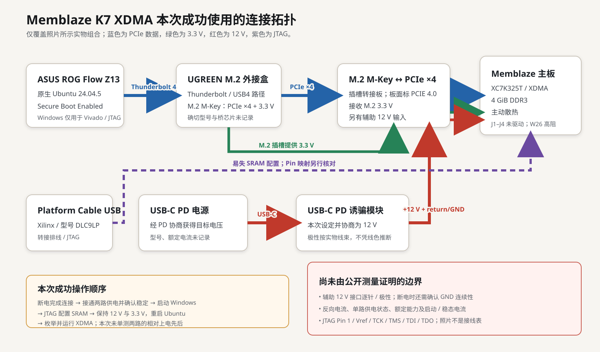
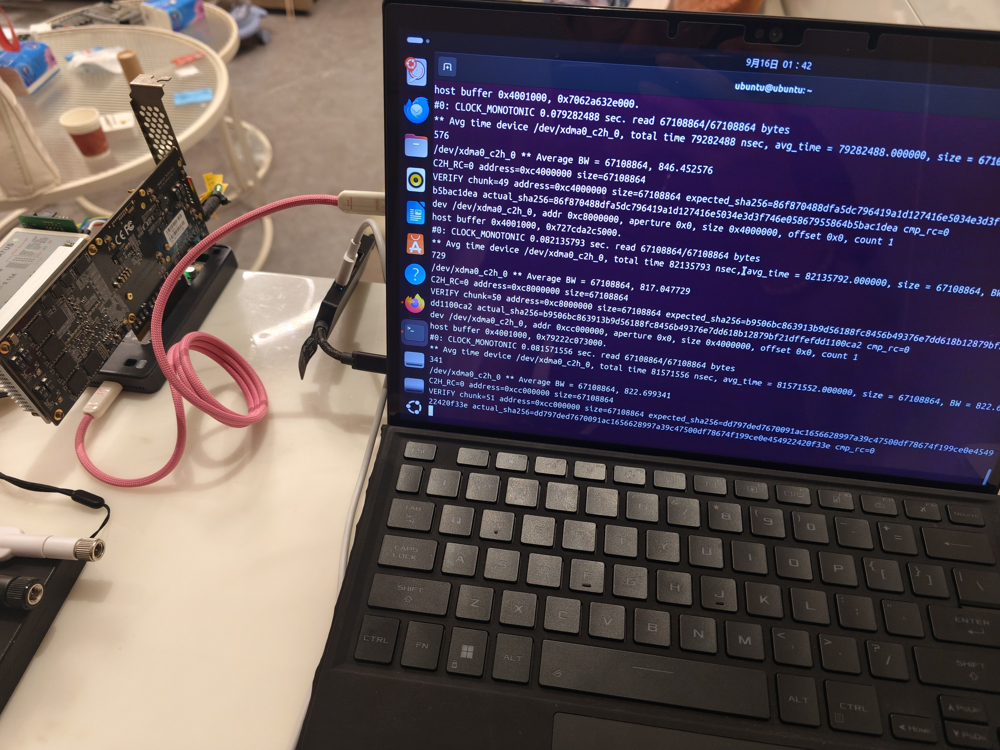

# Memblaze K7 XDMA Lab

我手里这块 Memblaze/PBlaze3 主板的存储子板已经不在了，但板上还有一颗
Kintex-7 `XC7K325T` 和 4 GiB DDR3。我从实物测量开始重新整理硬件，做了一套
可从源码构建的 FPGA 工程，让它在雷电 4 转接链路和原生 PCIe 插槽上都跑通了
XDMA。

仓库里已经包含 Vivado 2026.1 的完整构建输入、固定版本的 Linux XDMA 驱动和
实机测试脚本。现在它可以从干净 clone 生成 bitstream，通过 JTAG 配置 SRAM，
在 Ubuntu 下枚举为 `10ee:7024`，并完成全部 4 GiB DDR3 的写入、回读和比较。

[English](README.md) ·
[硬件连接](docs/HARDWARE_SETUP.zh-CN.md) ·
[FPGA 构建](fpga/README.md) ·
[实测结果](docs/VALIDATED_RESULTS.zh-CN.md) ·
[FPGA RAM 盘](experiments/ramdisk/README.zh-CN.md) ·
[完整回归](docs/EXACT_IMAGE_REGRESSION.zh-CN.md) ·
[故障排查](docs/TROUBLESHOOTING.zh-CN.md)



## 为什么 DMA 放在原生 Linux

我最初使用的是 Windows 笔记本，Vivado 构建、JTAG 下载和 PCIe 枚举都没有
问题。AMD 有 Windows XDMA 驱动，但源码需要单独
[申请访问](https://account.amd.com/en/forms/registration/xdma_windows_driver.html)，
自己构建后还要处理 Windows 内核驱动签名。本仓库没有一份能够直接安装、
适配这张卡并且可以随项目公开分发的已签名驱动，因此 DMA 验证改在原生
Linux 完成。

Linux 版则直接公开在
[`dma_ip_drivers`](https://github.com/Xilinx/dma_ip_drivers)，可以固定源码、
按当前内核构建，并通过 sysfs、`dmesg` 和 `/dev/xdma*` 查看完整状态。普通
WSL2 不能接管 Windows 控制的雷电 PCIe endpoint；如果开发机本来就是
[AMD 支持的 x86-64 Linux](https://docs.amd.com/r/zh-CN/ug973-vivado-release-notes-install-license/%E5%8F%97%E6%94%AF%E6%8C%81%E7%9A%84%E6%93%8D%E4%BD%9C%E7%B3%BB%E7%BB%9F)，
可以直接安装 Linux 版 Vivado 2026.1，在一个系统里完成构建、JTAG、驱动、
DMA、日志收集和 AI 辅助调试。

为了不重新分区笔记本内置的 Windows/BitLocker 硬盘，我用一只 250 GB
SanDisk 做了 Ubuntu 24.04.5 Persistent Live U 盘，其中 64 GiB 作为
`casper-rw`。系统、驱动构建、MOK 签名文件、脚本和日志都留在 U 盘，
实验时内部 NVMe 保持未挂载。已经有原生 Linux 的话，这一步可以直接省掉。

## 已经跑通的部分

| 阶段 | 实测结果 |
| --- | --- |
| FPGA 构建 | Vivado 2026.1 干净构建；DRC Error 0，setup WNS +0.038 ns，hold WHS +0.014 ns |
| 配置 | 通过 JTAG 写入 XC7K325T 易失 SRAM |
| PCIe | 唯一 `10ee:7024`、Subsystem `10ee:0007` 端点 |
| Linux | XDMA v2025.2.0 在 `7.0.0-31-generic` 上构建并加载，Secure Boot 保持开启 |
| DMA | 两组 H2C/C2H 引擎，基础往返和双通道并发比较通过 |
| DDR3 | 五个高地址哨兵和 64 × 64 MiB 全容量比较通过 |

后来换到 MS-A2 原生 PCIe 插槽，链路达到 Gen2 ×8；完整 4 GiB 分块传输实测
H2C 1432 MiB/s、C2H 1108 MiB/s，同样通过数据比较和清理。

干净构建和实机测试使用的 bitstream SHA-256 都是
`287f0ff1e9a0bef58842d1769e782fe06ed16cf3019d8e65477ca7a688f5b1c5`。
bitstream 由本地构建生成，不放进 Git。完整数字和精简证据见
[实测结果](docs/VALIDATED_RESULTS.zh-CN.md)。



## 硬件链路

最初的雷电测试使用 ASUS ROG Flow Z13、UGREEN 雷电/USB4 M.2 外接盒和
M.2 M-Key 转 PCIe ×4 转接板。M.2 插槽承担 PCIe 链路和 3.3 V 供电，独立
USB-C PD 电源通过诱骗模块向转接板提供 12 V。JTAG 使用 Xilinx Platform
Cable USB DLC9LP。

Windows 下用 Vivado 配置 FPGA SRAM 后，板卡保持供电，主机重启进入原生
Ubuntu，再完成 PCIe 枚举和 DMA 测试。实物照片、器材和连接细节都在
[硬件连接](docs/HARDWARE_SETUP.zh-CN.md)。
之后的 MS-A2 原生 PCIe 复测见[实测结果](docs/VALIDATED_RESULTS.zh-CN.md)。

FPGA 内部由 XDMA 提供两组 H2C 和两组 C2H 通道，AXI Memory Mapped 主口经
AXI Interconnect 和 MIG 访问 4 GiB DDR3。设计参数和地址空间跟源码放在
[`fpga/README.md`](fpga/README.md)。

## 快速开始

### 1. 构建并配置 FPGA

安装带 Kintex-7 支持的 Vivado 2026.1，在一个全新的短绝对路径中构建：

```powershell
& 'C:\AMD\Vivado\2026.1\bin\vivado.bat' -mode batch `
  -source C:/work/memblaze-k7-xdma-lab/fpga/build.tcl `
  -tclargs C:/work/memblaze-build --write-bitstream
```

上面是本次 clean build 使用的 Windows 命令。Linux 下调用 Vivado 安装目录
中的 `bin/vivado`，把仓库和构建目录换成 Linux 绝对路径即可，Tcl 入口和
参数保持不变；Linux 入口走同一份 Tcl，但没有计入当前的 clean-build 记录。

检查生成的 DRC 和时序报告，再按
[`fpga/README.md`](fpga/README.md) 将 bitstream 写入易失 SRAM，并生成
对应的 JTAG 记录。

### 2. 进入原生 Ubuntu 运行 XDMA

Ubuntu 24.04 可以先装齐构建和检查工具：

```bash
sudo apt update
sudo apt install --yes \
  bash coreutils diffutils gawk grep sed tar git build-essential patch kmod \
  pciutils mokutil openssl sudo udev util-linux psmisc \
  "linux-headers-$(uname -r)"
```

第一次调试建议逐级运行，在哪一级失败就停在哪一级排查：

```bash
./linux/01_probe.sh
./linux/02_build_driver.sh
./linux/03_secure_boot_status.sh /path/to/enrolled-MOK.der
./linux/04_load_verify.sh
./linux/05_dma_smoke.sh --confirm-ddr-write
./linux/06_extended_validation.sh --confirm-ddr-write alias-4g
./linux/06_extended_validation.sh --confirm-ddr-write chunked-1g
./linux/07_release_advanced.sh --confirm-ddr-write
./linux/99_cleanup.sh
```

[精确映像一次性回归](docs/EXACT_IMAGE_REGRESSION.zh-CN.md)提供完整发布测试命令，
把 bitstream 哈希、JTAG 记录、驱动构建、4 GiB 比较、内核日志和清理收进同一
份结果。MOK 创建、注册和模块签名见
[Secure Boot 指南](docs/SECURE_BOOT.zh-CN.md)。

## 仓库内容

| 路径 | 内容 |
| --- | --- |
| `fpga/` | Vivado 工程生成、Block Design、XDC、MIG 配置和 SRAM 下载脚本 |
| `linux/` | 枚举、驱动构建、签名检查、DMA、完整回归和清理脚本 |
| `vendor/` | 固定版本的上游 XDMA 源码归档和文件清单 |
| `docs/HARDWARE_SETUP.zh-CN.md` | 本次实测连接和供电 |
| `docs/VALIDATED_RESULTS.zh-CN.md` | 构建与实机结果 |
| `docs/TROUBLESHOOTING.zh-CN.md` | 调试中遇到的问题和解决方法 |
| `docs/NEXT_EXPERIMENTS.zh-CN.md` | 接下来值得继续做的实验 |
| `evidence/` | 脱敏后的干净构建和精确映像实机回归摘要 |

## 许可

除文件另有说明外，本项目原创内容使用 MIT License。固定版本的 XDMA 源码、
Kbuild 补丁和 MIG 配置保留各自的上游条款，详见
[`THIRD_PARTY_NOTICES.md`](THIRD_PARTY_NOTICES.md) 和 [`LICENSES/`](LICENSES/)。
